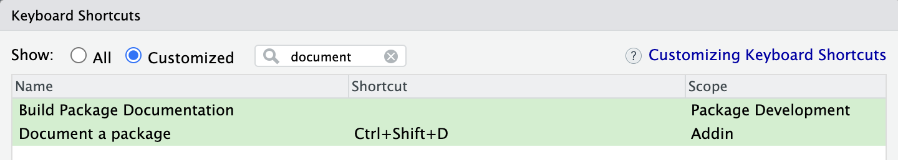

<!-- README.md is generated from README.Rmd. Please edit that file -->

```{r, include = FALSE}
knitr::opts_chunk$set(
  collapse = TRUE,
  comment = "#>",
  fig.path = "man/figures/README-",
  out.width = "100%"
)
```

# dir 

{dir} allows you to store your code in a nested folder structure, rather
than solely in the "R" folder, without any code duplication.

Set up your project with one command and work as usual, just with as
many folders as you like.

{dir} won't be needed by the end users of your package, you don't even
need it in your Suggests dependencies.

Your package won't violate any CRAN policy. See further below to
understand how it's possible.

## Installation

Install with:

``` r
pak::pak("cynkra/dir")
```

## Package Setup

To set up your package to use it with 'dir' we recommend the following :

```{r, eval = FALSE}
dir::use_dir_package("any_folder_in_your_repo", "maybe_another", patch = TRUE)
```

This will set your project's .RProfile so the multi folder thing just works.

Note that `patch = TRUE` means we modify in the scope of this project some functions 
from 'usethis' and 'devtools'. They still work as they did but now
support flexible folder structures. The default `patch = FALSE` is less
invasive, it doesn't touch those but places shims in a `"dir-overrides"`
environment on the search path.

For a better experience if you use RStudio we advise that you remap
Ctrl+Shift+D to call `devtools::document()` outside of the build pane,
because we can't patch the build pane and the output of
`devtools::document()` is usually terse enough anyway.

For this go to `Tools` / `Modify Keyboard Shortcuts` and use the
"Document a package" addin.



## How does it work?

`dir::use_dir_package()` sets a hook so any time it's loaded (by you,
not your users) :

-   We make sure your additional folders are added to ".Rbuidignore"
-   We load the code from your added folders into the `sysdata.rda` file
    in the R folder
-   We load the objects into the session
-   We patch (if you opt in) the 'usethis' and 'devtools' function that
    didn't play well with the flexible folder structure.

Files and folders starting with "\_" or "." in your added folders will
be ignored by the process.

So your code can be outside of the R folder but all the objects are
inside, and that makes it CRAN compliant.

<!-- Are you sure it is CRAN compliant? -->

<!-- CRAN doesn't want subfolders in R or unrecognized folders are the top -->
<!-- level. However this applies to your package, not your repo, whatever -->
<!-- illegal folders you have are invisible to CRAN, it's all in the legal -->
<!-- `sysdata.rda` file. We don't use `sysdata.rda` as intended, but we don't -->
<!-- break rules either. -->

<!-- [Straight from the -->
<!-- source](https://cran.r-project.org/doc/manuals/r-devel/R-exts.html#Package-subdirectories-1) -->

<!-- > The R subdirectory contains R code files, only. [...] -->
<!-- > -->
<!-- > Two exceptions are allowed: if the R subdirectory contains a file -->
<!-- > sysdata.rda (a saved image of one or more R objects: please use -->
<!-- > suitable compression as suggested by tools::resaveRdaFiles, and see -->
<!-- > also the ‘SysDataCompression’ DESCRIPTION field.) this will be -->
<!-- > lazy-loaded into the namespace environment – this is intended for -->
<!-- > system datasets that are not intended to be user-accessible via data. -->
<!-- > Also, files ending in ‘.in’ will be allowed in the R directory to -->
<!-- > allow a configure script to generate suitable files -->

<!-- If you do want your source to be part of the package, have your nested -->
<!-- folders under "inst", but FWIW the functions are saved with their srcref -->
<!-- so the formatting and the comments are available without this. -->

## Do you have an example ?

Sure, here's a minimal example where you can inspect the file structure, NAMESPACE, .RProfile, .Rbuildignore etc : [https://github.com/cynkra/dir/tree/main/inst/dir.example](https://github.com/cynkra/dir/tree/main/inst/dir.example)

## History

This has been raised on
[r-devel](https://stat.ethz.ch/pipermail/r-devel/2009-December/056022.html)
[multiple](https://stat.ethz.ch/pipermail/r-devel/2010-February/056513.html)
[times](https://hypatia.math.ethz.ch/pipermail/r-devel/2023-March/082496.html)
but little interest has been shown to implement the
feature, so here we are.

## Other efforts

These packages implement other solutions to the problem of working with multiple code
folders: 

* (many)[https://github.com/the-y-company/many] by John Coen (The Y Company)
* (rfold)[https://github.com/feddelegrand7/rfold] by Mohamed El Fodil Ihaddaden
packages in 

